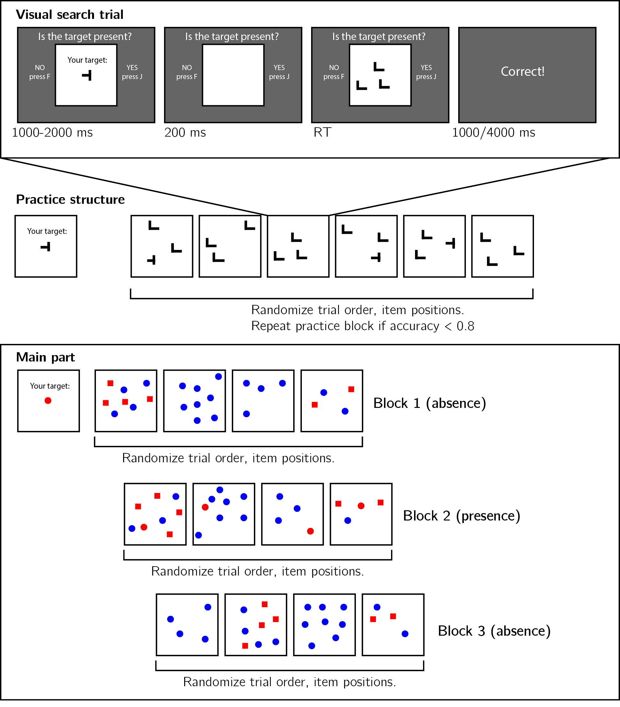

```{r setup, include = FALSE}
library("papaja")
r_refs("r-references.bib")
library('reticulate')
library('tidyverse')
library('broom')
library('cowplot')
library('MESS') # for AUCs
library('lsr') # for effect sizes
library('pwr') # for power calculations
library('brms') # for mixed effects modeling
library('BayesFactor') # for Bayesian t test
library('jsonlite') #parsing data from sort_trial
```

```{python, include=FALSE}
import json
import pandas as pd
import numpy as np
from os import path as path

def to_csv(filename):
    dfs=[]
    with open(filename+'.txt') as json_file:
        for i,line in enumerate(json_file):
            if line[0:14]!='Consent given.':
                dfs.append(pd.read_json(line))
            

    group_df = pd.concat(dfs)
    group_df.to_csv(filename+'.csv', index=False)
    return(group_df)
    
group_df = to_csv(path.join('..','experiments','Experiment2','data','jatos_results_batch1'))
group_df[group_df.trial_type=='survey-text'].responses

```

```{r analysis-preferences}
# Seed for random number generation
set.seed(42)
knitr::opts_chunk$set(cache.extra = knitr::rand_seed)
```

<!-- # Introduction  -->

<!-- In visual search tasks, participants report the presence or absence of a target stimulus among distractor stimuli. While 'target-present' responses are simply triggered by the detection of a target, what triggers 'target-absent' responses is a more difficult question, and different accounts of visual search propose different termination mechanisms. According to one model, participants scan items in random order until a target is detected or until all items have been scanned, at which point a 'target-absent' response is given (*serial self-terminating search*). While this model successfully accounts for some observations, it fails to explain search time patterns in highly efficient searches (like when searching for red among green items), where the timing of 'target-absent' responses is virtually independent of the number of distractors. More advanced models propose that search is terminated once participants exhaust some subset of the stimuli, chosen preattentively and in a manner that optimizes speed and accuracy [Guided Search; @wolfe1989guided; @wolfe1994guided; @wolfe2007guided], that the probability of quitting a search increases following the scanning of each item [@moran2013competitive; @wolfe2010varying], or that search is terminated by means of a stochastic timer [@moran2013competitive]. Common to these models is the need in prior knowledge about expected search time or efficiency. In order to conclude that a target is missing from the display after scanning only a subset of items, subjects need to know that a target would have already been selected for attention, if present. Similarly, the search timer should only go off once chances are that a target would have already been found. But where does this knowledge come from?  -->

<!-- For example, in the simplest exhaustive serial search models []Cognitive models of VS specify how participants detect a target among distractors [@treisman1980feature; @wolfe1989guided; @wolfe1994guided; @wolfe2007guided]. Much less is known about the mechanisms that allow participants to conclude that a target was missing. Common to models of search termination is the implicit or explicit implementation of counterfactual beliefs about finding a hypothetical target. For example, in later versions of the Guided Search model, search termination was the result of an exhaustive search on those items that surpassed a learned *activation threshold*, which is flexibly adapted to maximize accuracy and response time [@chun1996just; @wolfe1994guided]. This proposal assumed that search termination necessarily relies on online learning of previous search efficiency when performing the task. In another variant of the Guided Search model, search termination was proposed to be the result of probabilistically selecting a *quit unit* [@moran2013competitive]. the probability of selecting the quit unit in this model was a function of a several factors, including a free parameter $\Delta w_{quit}$ that indexes counterfactual beliefs about finding a target, had it been present. The origin of these beliefs is however left unspecified in the model.  -->

<!-- Beliefs about the expected time taken to detect a target can draw on previous experience in the task. Indeed, search time in target-absent trials decreases following successful target-present trials, and sharply increases following target  misses [@chun1996just]. This heuristic is limited to repetitive searches of the same target in similar displays, as is often the case in visual search experiments. However, in everyday life visual searches are usually performed only once, such that relying on previous repetitions of the same search is impossible. Only the first trials of a visual search experiment, where participants meet the stimuli for the first time, are a good model of this one-shot search behaviour. In these trials, search time relies solely on subjects' metacognitive beliefs about search efficiency prior to engaging with the task. This fact makes search time in the first trials a rare window into participants’ intuitive theory of attention and visual search, what we refer to here as *Visual Search Schema*. Furthermore, participants' ability to learn from positive examples (target-present trials), and their ability to generalize their knowledge across stimulus types and displays, offers an opportunity to study the structure of this simplified schema, its building blocks, and the inductive biases that guide its acquisition. In this study, we use target-absent trials in visual search to ask what participants know about their spatial attention before engaging with the visual search task, and how this knowledge is built and expanded based on experience. -->

<!-- Specifically, we focus on the pop-out effect for color search: When searching for a deviant color, search time is nearly unaffected by the number of distractors for target-present and target-absent responses alike [@treisman1980feature;  @wolfe1998can]. In a series of three experiments we ask whether and how the color pop-out effect for target-absent trials is dependent on prior experience with the task and stimuli. Unlike typical visual search experiments that comprise hundreds or thousands of trials, here we collect only a handful of trials from a large pool of online participants. This unusual design allows us to investigate search time patterns in the first trials of the experiment. Furthermore, by making sure that the first displays do not include the target stimulus, we we are able for the first time to ask what knowledge is available to participants about their expected search efficiency prior to engaging with the task. The presence of a pop-out effect in target-absent trials prior to any target-present trials would indicate that knowledge about the salience of a divergent color is available at some form in the cognitive system, and that this knowledge can flexibly be put to use for counterfactual reasoning in the process of inference about absence. Conversely, the absence of a pop-out effect would mean that positive experience is necessary for this knowledge to be acquired, or to be expressed.  -->

<!-- In this study we ask what portion of this implicit metacognitive knowledge about search efficiency is available prior to engaging with the task, how it is expanded based on positive samples, and how it is used to make efficient inference about absence. In the experiments outlines below, target-present trials are used as learning samples (where subjects observe how efficiently they can find a target), and target-absent trials are used as test trials (where subjects terminate the search when they believe a target would have been found). By testing participants' prior knowledge state, and their ability to learn and generalize from a few positive samples, we lay the groundwork for building a model of the Visual Search Schema.  -->

 
```{r load_data, echo=FALSE, cache=TRUE}

df <- read_csv('../experiments/Experiment2/data/jatos_results_batch1.csv') %>%
  rename('subj_id' = 'subject_identifier') %>%
  mutate(subj_id=factor(subj_id))

N_total <- df$subj_id%>%unique()%>%length()

estimates <- df %>%
  filter(test_part=='sort_trial') %>%
  select(
    subj_id,
    final_locations) %>%
  mutate(final_locations = map(final_locations, ~ fromJSON(.) %>%
                                 as.data.frame())) %>%
  unnest(final_locations) %>%
  mutate(stimulus=substr(src,9,nchar(src)-4))%>%
  group_by(subj_id)%>%
  mutate(rank_x=rank(x))%>%
  select(subj_id,stimulus,x, rank_x) 

num_moves<- df %>%
     filter(test_part=='sort_trial') %>%
     select(
         subj_id,
         moves) %>%
     mutate(moves = map(moves, ~fromJSON(.) %>%
                          as.data.frame())) %>%
  unnest(moves) %>%
  group_by(subj_id) %>%
  tally()

prior_experience1 <- df %>%
  filter(test_part=='prior_experience1') %>%
  select('subj_id','responses') %>%
  mutate(responses =substr(responses,8,nchar(responses)-2))

prior_experience2 <- df %>%
  filter(test_part=='prior_experience2') %>%
  select('subj_id','responses') %>%
  mutate(description=substr(responses,15,nchar(responses)-2))

prior_experience <- merge(
  prior_experience1,
  prior_experience2,
  all=TRUE) %>%
  mutate(experience=ifelse(responses=='no','no',description)) %>%
  select('subj_id','experience')

search_df <- merge(df,prior_experience) %>%
  filter((test_part=='absence1') | (test_part=='absence2') | (test_part=='presence1')) %>%
  select('subj_id','test_part','set_size','target_present','correct','RT','search_type','experience') %>%
  mutate(target= ifelse(test_part=='Q_in_O_vs', 1, 2),
         response = ifelse(correct==1, target_present, 1-target_present)) %>%
  mutate(trial = sequence(rle(as.character(subj_id))$lengths),
         i = trial%%4,
         i = ifelse(i==0,1.5,i-2.5))

minRT <- 250
maxRTsubj <- 5000 # for subject exclusion
maxRTtrial <- 1000 #for trial exclusion
min_acc_search <- 5/6

##exclude subjects
excluded <- search_df %>%
  group_by(subj_id) %>%
  summarise(acc = mean(correct),
            RTlow = quantile(RT,0.25),
            RThigh = quantile(RT,0.75))%>%
  filter(acc<min_acc_search | RTlow<minRT | RThigh>maxRTsubj) %>%
  select('subj_id')

correctOrderEffects <- function(df) {
  fit <- lm(RTfiltered ~ i, data=df)
  slope = fit$coefficients[2];
  return(df$RTfiltered-slope*(df$i-2.5))
}

search_df <- search_df %>%
  mutate( include=RT>minRT & 
            RT<maxRTtrial & correct==1 & 
            !subj_id%in%excluded$subj_id,
          RTfiltered = ifelse(include, RT, NA)) %>%
  group_by(test_part) %>%
  do(mutate(.,RTcorrected = correctOrderEffects(.)))


  
search_df$test_part = factor(search_df$test_part, levels = c('absence1','presence1','absence2'))
search_df$search_type = factor(search_df$search_type, levels = c('shape','conjunction'))


descriptives <- search_df %>% 
  filter(!subj_id%in%excluded$subj_id) %>%
  group_by(subj_id) %>%
  summarise(accuracy=mean(correct), RT=median(RT))
```

# Methods
We report how we determined our sample size, all data exclusions (if any), all manipulations, and all measures in the study. <!-- 21-word solution (Simmons, Nelson & Simonsohn, 2012; retrieved from http://ssrn.com/abstract=2160588) -->

## Participants

The research complied with all relevant ethical regulations, and was approved by the Research Ethics Committee of University College London (study ID number 1260/003). `r N_total` Participants were recruited via Prolific, and gave their informed consent prior to their participation. They were selected based on their acceptance rate (>95%) and for being native English speakers. We collected data until we reached 320 included participants for each of our hypotheses (after applying our pre-registered exclusion criteria). The entire experiment took around 3 minutes to complete (median completion time in our pilot data: 3:06 minutes). Participants were paid £0.38 for their participation, equivalent to an hourly wage of £7.60.

## Procedure

Participants were first instructed about the visual search task. Specifically, that their task is to report, as accurately and quickly as possible, whether a target stimulus was present (press 'J') or absent (press 'F'). Then, practice trials were delivered, in which the target stimulus was a rotated *T*, and distractors are rotated *L*s. The purpose of the practice trials was to familiarize participants with the structure of the task. For these practice trials the number of items was always 3. Practice trials were delivered in small blocks of 6 trials each, and the main part of the experiment started only once participants responded correctly on at least five trials in a block (see Figure \@ref(fig:design)). 


```{r design, echo=FALSE, fig.cap="Experimental design. Top panel: each visual search trial started with a screen indicating the target stimulus. The search display remained visible until a response is recorded. To motivate accurate responses, the feedback screen remained visible for one second following correct responses and for four seconds following errors. Middle panel: after reading the instructions, participants practiced the visual search task in blocks of 6 trials, until they had reached an accuracy level of 83% correct or higher (at most one error per block of 6 trials). Bottom panel: the main part of the experiment comprised 12 trials only, in which the target was a red circle. Unbeknown the subjects, only trials 5-8 (Block 2) were target-present trials, and the remaining trials were target-absent trials. Each 4-trial block followed a 2 by 2 design, with factors being set size (4 or 8) and distractor type (color or conjunction; blue circles only or blue circles and red squares, respectively).", out.width = '100%'}

```

In the main part of the experiment, participants searched for a red circle among blue circles or a mixed array of blue circles and red squares. Set sizes was 4 or 12, resulting in a 2-by-2 design (search type: color or color$\times$shape, by set size: 4 or 12). Critically, and unknown to subjects, the first four trials were always target-absent trials (one of each set-size $\times$ search-type combination), presented in randomized order. These trials were followed by the four corresponding target-present trials, presented in randomized order. The final four trials were again target-absent trials, presented in randomized order.

<!-- ## Experiment 2 (conditioned on the results of Experiment 1) -->

<!-- Experiment 2 will be identical to Experiment 1, except for the order of blocks. This experiment will start with 4 Target Presence trials, followed by 4 target-absent trials, followed by 4 target-present trials. The purpose of this order reversal manipulation is to test whether the pattern observed in Experiment 1 (for example, a learning effect between blocks 1 and 3) is unique to Target Absence trials, or alternatively emerges in the first trials of the experiment, regardless of the presence or absence of a target. -->

<!-- ## Experiment 3 (conditioned on the results of Experiments 1 and 2) -->

<!-- Experiment 3 will be identical to Experiment 1, except for the four 'target-present' trials. Only in these four trials, blue circles will be replaced by green circles. The purpose of this manipulation is to test whether any learning between blocks 1 and 3 in Experiment 1 critically depends on direct experience with searching among distractors of a specific color, or alternatively, if learning about color search efficiency generalizes across colors. -->

### Randomization

The order and timing of experimental events was determined pseudo-randomly by the Mersenne Twister pseudorandom number generator, initialized in a way that ensures registration time-locking [@mazor2019novel]. 

## Data analysis

### Rejection criteria

Participants were excluded for making more than one error in the main part of the experiment, or for having extremely fast or slow reaction times in one or more of the tasks (below 250 milliseconds or above 5 seconds in more than 25% of the trials). 

Error trials, and trials with response time below 250 milliseconds or above 1 second were excluded from the response-time analysis.

### Data preprocessing

To control for within-block trial order effects, a separate linear regression model was fitted to the data of each block, predicting search time as a function of trial serial order ($RT \sim \beta_0+\beta_1i$, with $i$ denoting the mean-centered serial position within a block). Search times were corrected by subtracting the product of the slope and the mean-centered serial position, in a block-wise manner.

### Hypotheses and analysis plan

This study is designed to test several hypotheses about the contribution of metacognitive knowledge to search termination, the state of this knowledge prior to engaging with the task, and the effect of experience trials on this metacognitive knowledge. We outline some possible search time patterns and their interpretation in Fig. \@ref(fig:models). In the next section we demonstrate our hypotheses and analyses on pilot data.


```{r models, echo=FALSE, fig.cap="Top left: typical search time results in visual search experiments with many trials. Set size (x axis) affects search time in conjunction search, but much less so in color search. However, it is unclear whether this pattern is also true for the first trials in an experiment. Top right: one possible pattern is that the same qualitative pattern will be observed in our design, with an overall decrease in response time as a function of trial number. This will suggest that the metacognitive knowledge necessary to support efficient inference about absence was already in place before engaging with the task. Bottom left: an alternative pattern is that the same qualitative pattern will be observed for blocks 2 and 3, but not in block 1. This will suggest that for inference about absence to be efficient, participants had to experience some target-present trials. Bottom right: alternatively, some of the metacognitive knowledge is available prior to engaging with the task, and some is acquired by exposure to target-present trials. This will manifest as different slopes for conjunction and color searches in blocks 1 and a learning effect for color search between blocks 1 and 3.", out.width = '100%'}
knitr::include_graphics("figures/models.png")
```


Subject-wise search slopes were extracted for each combination of search type (color or conjunction) and block number by fitting a linear regression model to the reaction time data with one intercept and one set-size term. 

Analysis comprised a positive control based on target-present trials, a test of the presence of a pop-out effect for color search in block 1, and a test for the change in slope for color search between blocks 1 and 3. All hypotheses were tested using a within-subject t-test, with a significance level of 0.05. 
Given the fact that we only have one trial per cell, one excluded trial is sufficient to make some hypotheses impossible to test on a given participant. For this reason, for each hypothesis separately, participants were included only if all necessary trials met our inclusion criteria. This means that some hypotheses were tested on different subsets of participants.

## Results

We used `r cite_r("r-references.bib")` for all our analyses.


```{r analyze_data, echo=FALSE, cache=TRUE}

median_search_times <- search_df %>%
  filter(include==1) %>%
  group_by(test_part,set_size,search_type) %>%
  summarise(mean_trial=mean(trial),median_RT= median(RTcorrected), 
            sem_RT=se(RTcorrected)*1.2533)%>%
  mutate(response=test_part=='presence1')

mean_acc <- search_df %>%
  group_by(test_part,set_size,search_type) %>%
  summarise(mean_acc=mean(correct))%>%
  mutate(response=test_part=='presence1')

search_slopes <- search_df %>%
  filter(include==1) %>%
  group_by(subj_id,search_type,test_part) %>%
  do(model=lm(RTcorrected~set_size,data=.)) %>%
  tidy(model) %>%
  filter(term=='set_size')

mean_search_slopes <- search_slopes %>%
  group_by(search_type,test_part) %>%
  summarise('mean_slope'=mean(estimate,na.rm=TRUE),
            'se_slope' = se(estimate, na.rm=TRUE))

slopes_wide <- pivot_wider(search_slopes,
                           id_cols = 'subj_id',
                           names_from = c('search_type','test_part'),
                           values_from = estimate)
```

Overall mean accuracy was `r printnum(mean(descriptives$accuracy))` (standard deviation =`r printnum(sd(descriptives$accuracy))`). The median reaction time was `r printnum(median(descriptives$RT))` ms (median absolute deviation = `r printnum(mad(descriptives$RT))`). In all further analyses, only correct trials with response time between 250 and 1000 ms are included. 

*Hypothesis 1 (positive control)*: Search times in block 2 (target-present) followed the expected pattern, with a steep slope for conjunction search (`r apa_print(t.test(slopes_wide$conjunction_presence1,na.rm=TRUE))$estimate`) and a shallow slope for conjunction search (`r apa_print(t.test(slopes_wide$shape_presence1,na.rm=TRUE))$estimate`; see Fig. \@ref(fig:exp1Plot)). The slope for shape search was significantly lower than 10 ms/item and thus met our criterion for being considered 'pop-out' (`r apa_print(t.test(slopes_wide$shape_presence1,na.rm=TRUE,mu=10,alternative='less'))$statistic`). Furthermore, the difference between the slopes was significant (`r apa_print(t.test(slopes_wide$conjunction_presence1-slopes_wide$shape_presence1,na.rm=TRUE))$statistic`). This positive control served to validate our method.

*Hypothesis 2*: Our central focus was on results from block 1 (target-absent). Here participants didn't yet have experience with searching for the red circle. Similar to the second block, the slope for the conjunction search was steep (`r apa_print(t.test(slopes_wide$conjunction_absence1,na.rm=TRUE))$estimate`). A clear ‘pop-out’ effect for shape search was also evident (`r apa_print(t.test(slopes_wide$shape_absence1,na.rm=TRUE,mu=10, alternative='less'))$full_result`). Furthermore, the average search slope for shape search in this first block was significantly different from that of the conjunction search (`r apa_print(t.test(slopes_wide$conjunction_absence1-slopes_wide$shape_absence1,na.rm=TRUE))$statistic`), indicating that a shape-absence pop-out does not depend on task experience.

*Hypothesis 3*: Like in the first block, in the third block shape search complied with our criterion for ‘pop-out’  (`r apa_print(t.test(slopes_wide$shape_absence2,na.rm=TRUE,mu=10, alternative='less'))$full_result`), and was significantly different from the search for conjunction search (`r apa_print(t.test(slopes_wide$conjunction_absence2-slopes_wide$shape_absence2,na.rm=TRUE))$statistic`). This result is not surprising, given that a pop-out effect was already observed in block 1.

*Hypothesis 4*: To quantify the learning effect for shape search, we directly contrasted the search slope for shape search in blocks 1 and 3. We find no evidence for a learning effect (`r apa_print(t.test(slopes_wide$shape_absence1-slopes_wide$shape_absence2,na.rm=TRUE))$statistic`). Furthermore, a Bayesian t-test with a scaled Cauchy prior for effect sizes (r=0.707) provided strong evidence in favour of the absence of a learning effect (`r apa_print(ttestBF(na.omit(slopes_wide$shape_absence1-slopes_wide$shape_absence2)))$statistic`).

*Hypothesis 5*: In case of a learning effect for pop-out search, Hypothesis 5 was designed to test the specificity of this effect to shape pop-out by computing an interaction of block number and search type. Given that no learning effect has been observed, this test makes little sense. For completeness, we report that the change in slope between blocks 1 and 3 was similar for shape and conjunction search (`r apa_print(t.test(slopes_wide$shape_absence1-slopes_wide$shape_absence2-slopes_wide$conjunction_absence1+slopes_wide$conjunction_absence2,na.rm=TRUE))$full_result`). 


```{r exp1Plot, echo=FALSE, fig.cap="Upper panel: median search time by distractor set size for the two search tasks across the three blocks. Correct responses only. Lower panel: accuracy as a function of block, set size and search type. Error bars represent the standard error of the median."}

block_names <-  c("Block 1 (Absence)", "Block 2 (Presence)", "Block 3 (Absence)");

names(block_names) <- c("absence1", "presence1", "absence2");
RTplot <- ggplot(data=median_search_times, 
       aes(x=set_size, y=median_RT, color=search_type, fill=search_type, linetype=test_part)) +
  geom_line(size=1) +
  geom_point(aes(shape = search_type), size=4, color="black",stroke=1.5) +
  scale_shape_manual(values=c(22,21))+
  scale_fill_manual(values = c("#e41a1c",'black'))+
  scale_color_manual(values = c("#e41a1c",'black'))+
  scale_linetype_manual(values=c("21", "solid","21"))+
  facet_grid(cols = vars(test_part))+
  geom_errorbar(aes(ymin=median_RT-sem_RT,ymax=median_RT+sem_RT),linetype="solid", width=0.6) +
  facet_grid(cols = vars(test_part), 
             labeller = labeller(test_part = block_names))+
  labs(x='set size',y='median RT (seconds)', title='Search time curves') + 
  theme_bw()+ 
  scale_x_continuous(breaks = c(4,8))+
  theme(legend.position=c(0.48,0.7),
        legend.background = element_rect(fill=NA))+
  guides(color = FALSE, linetype=FALSE) 

accplot <- ggplot(data=mean_acc, 
       aes(x=set_size, y=mean_acc, fill=search_type)) +
  geom_bar(position='dodge',stat='identity') +
  theme_classic()+ 
  scale_fill_manual(values = c("#e41a1c",'black'))+
  facet_grid(cols = vars(test_part))+
  labs(x='set size',y='accuracy') +
  scale_x_continuous(breaks = c(4,8))+
  scale_y_continuous(breaks = c(0.5,1))+
  coord_cartesian(ylim=c(0.5,1)) +
  theme(legend.position='none')+ theme(strip.background = element_blank(),
   strip.text.x = element_blank())

plot_grid(RTplot,accplot,nrow=2,rel_heights=c(3,1))

ggsave('results_noExperience.png',width=5,height=4.5)
# ggplot(data=mean_search_slopes, aes(x=search_type, y=mean_slope))+
#   geom_bar(aes(fill=search_type), stat="identity",show.legend = FALSE)+
#   geom_errorbar(aes(ymin=mean_slope-se_slope, ymax=mean_slope+se_slope), width=.2)+
#   facet_grid(cols=vars(test_part))+
#   labs(y='mean slope (ms/item)', title='Search slopes')+
#   theme_minimal()
```


\newpage

# References

\begingroup
\setlength{\parindent}{-0.5in}
\setlength{\leftskip}{0.5in}

<div id="refs" custom-style="Bibliography"></div>
\endgroup
